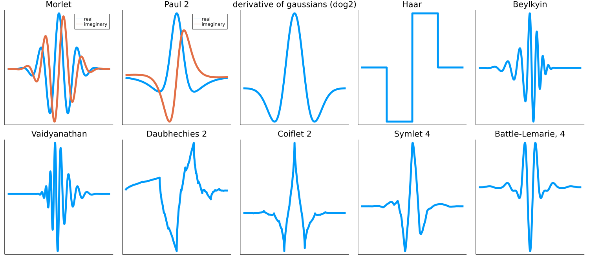

# ContinuousWavelets

[](https://travis-ci.com/dsweber2/ContinuousWavelets.jl)
[](https://codecov.io/gh/dsweber2/ContinuousWavelets.jl)
[](https://dsweber2.github.io/ContinuousWavelets.jl/dev/)

This package is an offshoot of [Wavelets.jl](https://github.com/JuliaDSP/Wavelets.jl) for the continuous wavelets.
Thanks to [Felix Gerick](https://github.com/fgerick) for the initial implementation there, with extension and further adaptation by David Weber and any other contributors listed on the right.
Currently, it implements 1D continuous wavelet transforms with the following mother wavelets:



Which covers several standard continuous wavelet families, both real and analytic, as well as continuous versions of the orthogonal wavelet transforms implemented in [Wavelets.jl](https://github.com/JuliaDSP/Wavelets.jl).

## Basic Usage

Install via the package manager and load with `using`

```julia
julia> Pkg.add("ContinuousWavelets")
julia> using ContinuousWavelets
```

Basic usage example on a doppler test function.

```julia
julia> using ContinuousWavelets, Plots, Wavelets

julia> n = 2047;

julia> t = range(0, n / 1000, length=n); # 1kHz sampling rate

julia> f = testfunction(n, "Doppler");

julia> p1 = plot(t, f, legend=false, title="Doppler", xticks=false)
Plot{Plots.PyPlotBackend() n=1}

julia> c = wavelet(Morlet(π), β=2)

julia> res = ContinuousWavelets.cwt(f, c)
┌ Warning: the lowest frequency wavelet has more than 1% its max at zero, so it may not be analytic. Think carefully
│   lowAprxAnalyt = 0.06186323501016359
└ @ ContinuousWavelets ~/allHail/projects/ContinuousWavelets/src/sanityChecks.jl:6
2047×31 Matrix{ComplexF64}:
 -2.84943e-6+3.86436e-19im   1.44519e-5-1.62298e-9im    1.39273e-5-3.07331e-8im    1.08277e-5-5.36965e-8im   7.74125e-6-8.67067e-8im  …    9.29111e-5+9.88368e-5im    0.000123188+0.000115321im   0.000125192+0.000112017im   0.000109884+9.67013e-5im
 -2.84699e-6-6.11361e-20im   1.44509e-5-4.88515e-9im    1.39292e-5-9.21574e-8im    1.08334e-5-1.6091e-7im    7.75377e-6-2.59599e-7im     -0.000113733+0.000116674im  -0.000110639+0.000149352im   -9.89185e-5+0.000149589im   -8.24222e-5+0.000130545im
 -2.84212e-6+4.37411e-20im   1.44489e-5-8.19594e-9im    1.39331e-5-1.53456e-7im    1.08446e-5-2.67585e-7im    7.7787e-6-4.30934e-7im     -0.000167268-0.000109989im  -0.000189571-8.93572e-5im   -0.000180219-7.17018e-5im   -0.000153333-5.64666e-5im
            ⋮                                                                                                                         ⋱                                                                                                  ⋮
 0.000165633+5.67188e-19im  -0.00058197+8.36266e-6im  -0.000174944+4.74775e-6im  -0.000102926+3.76705e-6im  -6.69025e-5+3.10797e-6im  …   -2.52619e-6+6.30254e-8im    -2.50166e-6+3.43068e-8im    -2.48306e-6+6.63823e-9im    -2.46986e-6-1.96881e-8im
 0.000165423+1.25225e-18im  -0.00058202+2.78765e-6im  -0.000175007+1.58289e-6im  -0.000102997+1.2562e-6im   -6.69813e-5+1.03676e-6im      -2.70744e-6+6.32005e-8im    -2.67909e-6+5.74545e-8im    -2.65444e-6+5.18306e-8im    -2.63276e-6+4.61939e-8im


```

And now we make a scalogram to actually visualize these entries:

```julia
freqs = getMeanFreq(ContinuousWavelets.computeWavelets(n, c)[1])
freqs[1] = 0
p2 = heatmap(t, freqs, log.(abs.(res).^2)', xlabel= "time (s)", ylabel="frequency (Hz)", colorbar=false, c=cgrad(:viridis, scale=:log10))
l = @layout [a{.3h};b{.7h}]
plot(p1,p2,layout=l)

# output
┌ Warning: the lowest frequency wavelet has more than 1% its max at zero, so it may not be analytic. Think carefully
│   lowAprxAnalyt = 0.06186323501016359
└ @ ContinuousWavelets ~/allHail/projects/ContinuousWavelets/src/sanityChecks.jl:6
Plot{Plots.PyPlotBackend() n=2}
```


As the cwt frame is redundant, there are many choices of dual/inverse frames. There are three available in this package, `NaiveDelta()`, `PenroseDelta()`, and `DualFrames()`. As a toy example, lets knock out the middle time of the bumps function and apply a high pass filter:

```julia
f = testfunction(n, "Bumps");
p1 = plot(f, legend = false, title = "Bumps", xlims = (0, 2000), linewidth = 2)
c = wavelet(dog2, β = 2)
res = ContinuousWavelets.cwt(f, c);
# dropping the middle peaks
res[620:1100, :] .= 0
# and smoothing the remaining peaks
res[:, 10:end] .= 0
freqs = ContinuousWavelets.getMeanFreq(f, c)
p2 = heatmap(1:n, freqs, abs.(res)', xlabel = "time (ms)", ylabel = "Frequency (Hz)", colorbar = false, c = :viridis)
dropped = ContinuousWavelets.icwt(res, c, DualFrames());
p1 = plot(f, legend=false, title="Smoothing and dropping bumps", linewidth=2)
plot!(dropped, linewidth=3)
l = @layout [a{0.3h}; b{0.7h}]
plot(p1, p2, layout=l)
```


It can also handle collections of examples at the same time, should you need to do a batch of transforms:

```julia
julia> exs = cat(testfunction(n, "Doppler"), testfunction(n, "Blocks"), testfunction(n, "Bumps"), testfunction(n, "HeaviSine"), dims=2);

julia> c = wavelet(cDb2, β=2, extraOctaves=-0)


julia> res = circshift(ContinuousWavelets.cwt(exs, c), (0, 1, 0))
┌ Warning: the highest frequency wavelet has more than 1% its max at the end, so it may not be analytic. Think carefully
│   highAprxAnalyt = 0.2677814440444114
└ @ ContinuousWavelets ~/allHail/projects/ContinuousWavelets/src/sanityChecks.jl:10
2047×32×4 Array{Float64, 3}:
[:, :, 1] =
  1.89367e-5   0.000266033  0.000196408  2.69195e-5  -3.89652e-5    2.16388e-5    5.12054e-6    1.28445e-5    8.80563e-6   -3.03165e-6   …   4.1931e-5   2.56883e-5   1.11543e-5   0.0001302     0.00014971    0.000121129   9.23682e-5    4.6727e-5    2.99983e-6
  8.33321e-5   0.000266913  0.000201712  3.29627e-5  -2.66883e-5    2.77846e-6   -2.97633e-6    6.21157e-6   -9.71867e-6    2.7643e-7        3.11254e-5  2.81226e-5  -5.40579e-5  -6.86444e-6   -2.60132e-5   -1.90633e-5    3.35839e-7    1.56557e-5  -4.46419e-5
 -0.000103328  0.000267843  0.000207148  3.99906e-5  -1.42476e-5   -1.55926e-5   -9.1685e-6    -5.02878e-6   -2.4248e-5     6.1358e-7       -2.52349e-5  2.2203e-6   -7.19233e-5  -0.000134247  -0.000185149  -0.000169306  -0.000138073  -8.95268e-5  -0.000218151
  ⋮                                                                 ⋮                                                                    ⋱                            ⋮                                                                    ⋮
  2.24677e-6   0.00198709   0.00125155   0.00102844   0.000632336   0.00042174    0.000299062   0.000220383   0.00016631    0.000129339  …   1.08142e-5  8.93458e-6   8.10775e-6   6.74075e-6    6.35971e-6    5.66737e-6    4.55137e-6    4.24042e-6   3.80685e-6
  2.63848e-6   0.00198004   0.00123433   0.00102295   0.000628578   0.000418633   0.000296445   0.000218098   0.000164224   0.000127503      1.0134e-5   8.58386e-6   7.46987e-6   6.67256e-6    6.22906e-6    5.49586e-6    4.58582e-6    4.3791e-6    3.47575e-6

[:, :, 2] =
  7.81007e-18  0.0226754  0.00955729  0.00470372    0.00341201    0.000485718   1.73557e-18   5.20671e-18   4.33893e-18   2.38641e-18  …  -5.20671e-18   4.33893e-19   7.59312e-19  -8.67785e-19   1.08473e-18   3.57962e-18   9.32869e-18   3.03725e-18   3.68809e-18
 -3.47114e-18  0.022684   0.00950443  0.00469405    0.00345558    0.000533245   6.94228e-18   3.03725e-18   5.64061e-18   3.47114e-18     -4.33893e-18   1.73557e-18   1.95252e-18  -5.20671e-18  -3.47114e-18  -8.67785e-19   1.73557e-18  -1.73557e-18  -3.47114e-18
 -8.8948e-18   0.0226929  0.00944925  0.00468509    0.00349665    0.000582678   6.94228e-18   3.47114e-18   1.08473e-18   4.12198e-18     -6.94228e-18  -1.30168e-18   0.0          -3.03725e-18  -6.0745e-18   -4.33893e-18  -8.67785e-19  -9.11175e-18  -5.64061e-18
  ⋮                                                               ⋮                                                                    ⋱                               ⋮                                                                     ⋮
 -9.29595e-18  0.0341512  0.0108039   0.00053027   -1.27059e-17  -7.21065e-18  -2.17579e-18   5.42487e-18  -9.88076e-19  -1.09409e-18  …  -8.53177e-18  -3.62855e-18   9.53663e-20  -8.4483e-18   -7.06202e-18   8.83625e-19  -6.65106e-18  -3.40533e-18  -3.84208e-19
  1.27592e-18  0.0342157  0.0107729   0.000558637  -1.03715e-17  -1.59047e-17  -9.65462e-18  -2.48686e-18  -1.40747e-17  -5.22908e-18     -7.73537e-18  -3.79705e-18  -7.07248e-19  -6.8393e-18   -4.79875e-18   4.50903e-18  -1.1533e-18    4.21959e-18  -1.7043e-18

[:, :, 3] =
 -4.2736e-7   0.0059687   0.00256803  0.000892506  0.000666694  0.000301147  3.82829e-6  1.29851e-6  7.66955e-7  5.35497e-7  4.00142e-7  …  1.45139e-7  4.99075e-8  -9.20612e-8  3.04066e-8  -5.9781e-8   3.97814e-8  2.49033e-8  -3.38814e-8  4.47839e-8  1.86209e-8
 -4.39691e-7  0.00596762  0.00256378  0.000882834  0.000692389  0.000312787  4.02419e-6  1.31943e-6  7.6816e-7   5.30798e-7  3.92621e-7     1.3408e-7   3.7697e-8   -1.04444e-7  1.79019e-8  -7.12126e-8  2.76986e-8  1.21816e-8  -4.59854e-8  3.30771e-8  7.78201e-9
 -4.48084e-7  0.0059668   0.00256     0.000874593  0.000716669  0.000323261  4.23849e-6  1.34165e-6  7.69483e-7  5.25794e-7  3.84726e-7     1.21818e-7  2.59215e-8  -1.17043e-7  6.64397e-9  -8.31209e-8  1.61823e-8  7.4973e-10  -5.67431e-8  2.24685e-8  2.3172e-9
  ⋮                                                             ⋮                                                            ⋮           ⋱                                       ⋮                                                             ⋮
 -9.41123e-8  0.00339924  0.00166237  0.000172551  4.6324e-7    2.06885e-7   1.30403e-7  9.37244e-8  7.13242e-8  5.72789e-8  4.64663e-8  …  2.75449e-8  9.14308e-9  -2.21837e-8  6.00635e-9  -1.51657e-8  6.92345e-9  4.12867e-9  -8.75924e-9  8.01012e-9  4.78652e-9
 -9.36079e-8  0.0034061   0.00165751  0.000176759  4.68442e-7   2.0702e-7    1.29717e-7  9.27845e-8  7.02495e-8  5.62041e-8  4.52732e-8     2.71106e-8  8.2408e-9   -2.26158e-8  5.13317e-9  -1.52526e-8  6.79732e-9  3.9998e-9   -8.6509e-9   8.3188e-9   4.24252e-9

[:, :, 4] =
  0.000307454  -0.0150898   -0.00391724   0.0165289   0.0145612   0.0118882   0.00985582   0.00821569   0.00683073   0.00584833   0.0048567   …   0.00089222    0.000831253   0.000668075   0.000726803   0.00068323    0.000601507   0.000528795   0.000541871   0.000301757
  6.05948e-5   -0.0152536   -0.00405883   0.0162813   0.0143339   0.0116653   0.00964044   0.00800401   0.00661635   0.0056378    0.00463584      0.000646217   0.000582768   0.00041716    0.000497081   0.000440889   0.000347251   0.000286288   0.000307363   8.45503e-5
 -0.000106628  -0.0154172   -0.00420221   0.0160291   0.0141005   0.0114356   0.00941668   0.00778225   0.00639145   0.00541437   0.00440314      0.000408634   0.000329995   0.000191004   0.000257843   0.000209694   0.000118658   7.07121e-5    9.46531e-5   -2.5274e-5
  ⋮                                                               ⋮                                                               ⋮           ⋱                               ⋮                                                                     ⋮
 -0.000307094  -0.00755439  -0.00156729  -0.0169094  -0.0149407  -0.0122776  -0.0102333   -0.00858549  -0.00720571  -0.00620711  -0.00524102  …  -0.00123448   -0.0010473    -0.00101092   -0.000863868  -0.000856275  -0.000783526  -0.000647484  -0.000619672  -0.000594673
 -0.000378125  -0.00746687  -0.00146262  -0.0166726  -0.0147279  -0.0120716  -0.0100403   -0.008401    -0.0070218   -0.00603457  -0.0050571      -0.001105     -0.000985156  -0.000885942  -0.000850915  -0.000838149  -0.000765417  -0.000662793  -0.000663838  -0.00051676
```

And the plot of these:

```julia
p1 = plot(plot(exs[:, 1], legend=false, title="Doppler", yticks=[], xticks=[], linewidth=2), plot(exs[:, 2], legend=false, title="Blocks", yticks=[], xticks=[], linewidth=2), plot(exs[:, 3], legend=false, title="Bumps", yticks=[], xticks=[], linewidth=2), plot(exs[:, 4], legend=false, title="HeaviSine", yticks=[], xticks=[], linewidth=2), layout=(1, 4))
p2 = plot(heatmap(identity.(res[:, :, 1])', xticks=false, yticks=[], c=:viridis, colorbar=false), heatmap(identity.(res[:, :, 2])', xticks=false, yticks=[], c=:viridis, colorbar=false), heatmap(identity.(res[:, :, 3])', xticks=false, yticks=[], c=:viridis, colorbar=false), heatmap(identity.(res[:, :, 4])', xticks=false, yticks=[], c=:viridis, colorbar=false), layout=(1, 4))
l = @layout [a{0.3h}; b{0.7h}]
plot(p1, p2, layout=l)
```


There are also several boundary conditions, depending on the kind of data given; the default `SymBoundary()` symmetrizes the data, while `PerBoundary()` assumes it is periodic, and `ZPBoundary` pads with zeros.
All wavelets are stored in the Fourier domain, and all transforms consist of performing an fft (possibly an rfft if the data is real) of the input, pointwise multiplication (equivalent to convolution in the time domain), and then returning to the time domain.

Perhaps somewhat unusually, the averaging function, or father wavelet, is included as an option (the bottom row for the figure above). This can be either the paired averaging function or uniform in frequency (the `Dirac` averaging). The frequency coverage of the wavelets can be adjusted both in total frequency range both below by the `averagingLength` or above by the `extraOctaves` (caveat emptor with how well they will be defined in that case). The frequency density can be adjusted both in terms of the quality/scale factor `Q`, as well as how quickly this density falls off as the frequency goes to zero via `β`. Finally, depending on what kind of norm you want to preserve, `p` determines the norm preserved in the frequency domain (so `p=1` maintains the 1-norm in frequency, while `p=Inf` maintains the 1-norm in time).

## Possible extensions

- Higher dimensional wavelets have yet to be implemented.
- A DCT implementation of the symmetric boundary to halve the space and computational costs.
